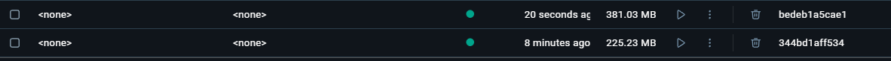
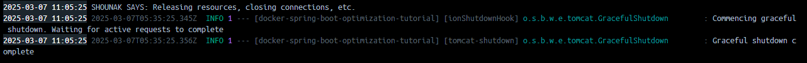
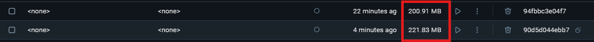

# Docker Introduction & Optimization

Hello Everyone and welcome to my session regarding docker.
The slide deck and common commands have already been given
to you, now let's do something hands on.

This project contains a simple hello world project (a simple server)
which we are going to docker-ize! 🤩

```dockerfile
FROM eclipse-temurin:21-jdk

LABEL authors="Shounak Bhalerao"
LABEL name="Dockerfile-0"

WORKDIR /app

EXPOSE 8080/tcp
COPY target/docker-spring-boot-optimization-tutorial-0.0.1-SNAPSHOT.jar app.jar
ENTRYPOINT ["java", "-jar", "app.jar"]
```

A simple docker file which selects a base image
adds some label (ofc I want my name in the authors)
and exposes the entrypoint.
Now what could be the problem??

# A Lot of things!

firstly, lets go over the size of this image:

This simple application, is taking half a GigaByte of storage!
That is not good. But what happened?

Turns out that the base image that we are using is problematic.

# Step #1: Use 'Lite' images

Images tagged with 'Alpine' are generally considered as the most lightweight
images. mainly because all the bloat has been removed from them. Lets use an
alpine image and check how what do we get:

- amazoncorretto:17-alpine
  

```dockerfile
FROM eclipse-temurin:21-jdk-alpine
LABEL authors="Shounak Bhalerao"
WORKDIR /app

COPY target/docker-spring-boot-optimization-tutorial-0.0.1-SNAPSHOT.jar app.jar
ENTRYPOINT ["java", "-jar", "app.jar"]
```

# Step #2: Use 'JRE' if you're just running jar files!

- eclipse-temurin:21-jre-alpine
  

```dockerfile
FROM eclipse-temurin:21-jre-alpine
LABEL authors="Shounak Bhalerao"
WORKDIR /app

COPY target/docker-spring-boot-optimization-tutorial-0.0.1-SNAPSHOT.jar app.jar
ENTRYPOINT ["java", "-jar", "app.jar"]
```


By simply changing our base image we have halved our container size!

# Intermission

Now lets get back to another problem, every time i make a change,
I need to manually run `mvn clean package` to remove previous `.jar` file created
and create a new one. Can i automate it without adding to the size of containers??

# Step #3: Use MultiStage Docker Builds

By adding STAGES using `as` keyword, we divide our workflow between different images.
our first image will build the application while our second will run it. Hence ensuring
the final image does not have its size increased.

```dockerfile
FROM maven:3.9.4-eclipse-temurin-17 AS build
WORKDIR /app
COPY . .
RUN mvn clean package -DskipTests

FROM eclipse-temurin:17-jre-alpine AS run
WORKDIR /app
COPY --from=build /app/target/docker-spring-boot-optimization-tutorial-0.0.1-SNAPSHOT.jar app.jar
EXPOSE 8080
CMD ["java", "-jar", "app.jar"]
```

# ~ Another Intermission

Until now we have been working on these images (which are basically stripped down version of linux)
and using Root User. This can lead to other problems if any attack gets into our system. and as a developer
I know that `docker run -it <IMAGE_NAME>` will provide me with interactive terminal (with root access if not secured) 😆
Hence lets add new use & group to our application. The following lines are important:

# Step #4: Use Non-Root User

#### (Principle of The Least Privilege)

```dockerfile
RUN addgroup -system appgroup && adduser -system appuser
RUN chown -R appuser:appgroup /app
```

# Step#5: Use Graceful Shutdown Hooks

Okay, so we all have been in a situation, where our PC suddenly
turned off and we lost our precious data in the way. Well docker has
a special ways to tell the application inside it that it is shutting down!

Awesome now we can let Spring boot know, that we got the shutdown command,
and quickly save all the tasks. This behaviour is clutch when you are working
with Faas or Serverless AWS Lambdas! (or even Spot Instances).

# Step#6: Using a good Garbage Collector

Different GC algorithms are available, and each has its strengths:

| GC Algorithm   | Best For                                  | JVM Flag              |
|----------------|-------------------------------------------|-----------------------|
| G1GC (Default) | Balanced performance & latency            | -XX:+UseG1GC          |
| ZGC            | Low-latency applications                  | -XX:+UseZGC           |
| Shenandoah GC  | Ultra-low pause times                     | -XX:+UseShenandoahGC  |
| Parallel GC    | High-throughput batch processing          | -XX:+UseParallelGC    |
| Serial GC      | Low-memory environments (containers)      | -XX:+UseSerialGC      |

Adding these lines to Select our Algorithm
```dockerfile
# NOTE WE CAN MERGE THESE 2 into singlar 
ENV JAVA_OPTS="-XX:+UseG1GC"

CMD ["java", "$JAVA_OPTS", "-jar", "app.jar"]
```

# Step #7: Making Java Container Aware
```dockerfile
ENV JAVA_CONTAINER="-XX:+UseContainerSupport -XX:MaxRAMPercentage=75 -XX:InitialRAMPercentage=50 -XX:MinRAMPercentage=50"
CMD ["java", "$JAVA_OPTS","$JAVA_CONTAINER", "-jar", "app.jar"]

```
We also need an entrypoint:
```dockerfile
# Assigning Permissions need to be done before jumping into normal user
COPY entrypoint.sh /entrypoint.sh
RUN chmod +x /entrypoint.sh
RUN chown -R appuser:appgroup /app
```
# Step #8: Using Layered builds:
You must have noticed by now that our builds are reaching 1 minute to build, 
This is because we are building it twice, once while creating the Jar and then executing.
What if we can copy the layers from the first build?
```dockerfile

```
think about 50 developers working on different builds! This reduces our time by half for simple application. 
But there is a Catch?! Can anyone guess? 



Yes for minor speed gain, we are adding manual files. and thats fine!

# Future Lesson
If you 💘 Optimization as these, we will have another session on:
```markdown
 Step #9: Use a Distroless Base Image
 Step #10: Enable Class Data Sharing (CDS) for Faster Startup
 Step #11: Remove Unused Layers with Squash (Reduces Size)
 Step #12: Compress JAR Using UPX (Reduces Size)
 Step #13: Use GraalVM Native Image for AOT Compilation
 Step #14: Use docker scout to Remove Security Vulnerabilities
 Step #15: Use Read-Only File System for Security
 Step #16: Enable JVM Heap Dump on OOM (Better Debugging & Performance Tuning)
```

Thats All Folks!
